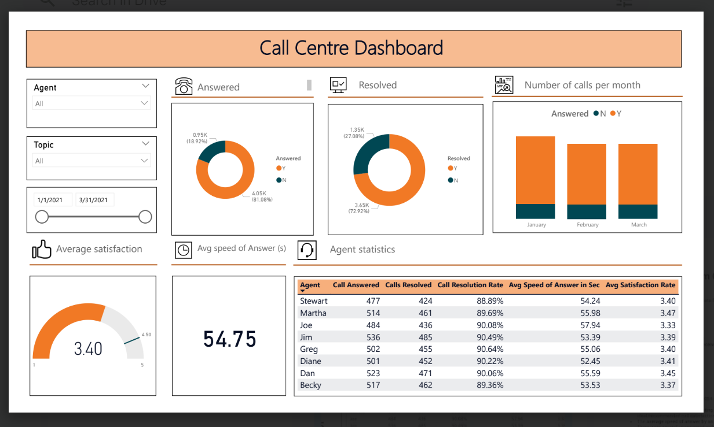

# Power-BI-Solution-for-Telecom-Company

This project is completed during the PwC Digital Accelerator Program, aimed to provide a Power BI solution to a Telecom Company. The project had three key deliverables:

 1) Call Center Data Dashboard: A Power BI dashboard was created to visualize and analyze call center data.
 2) Telecom Customer Churn Analysis: A BI solution was developed to understand and predict customer churn.
 3) Diversity and Inclusion Analysis: An analysis was conducted to understand diversity and inclusion within the organization.

### 1. Analysis of Call Centre’s Data : 

Report covers an analysis of call data from call center. The aim was to track the
process and performance of agents. 

#### Overview of Call Data :

  #### Total no of calls received : 5000
  #### Call Topics with count of call received:
* Technical Support: 1019
* Streaming: 1022
* Payment related: 1007
* Contract related: 976
* Admin Support: 976
  

#### Key Findings

* Out of the total calls received, 4054 were answered, with a total of 3646 calls
resolved.
* The average call satisfaction rating was 3.4/5, which is below the
ideal/recommended call satisfaction rate of 4.5.
* The average speed of answer by an agent was 54.75 seconds.
* There were several unanswered calls across different topics, with Technical
Support contributing the most with 214 unanswered calls.

#### Detailed Breakdown by Topic : 
| Topic | # Calls Unanswered | # Calls Resolved | 
|----------|----------|----------|
| Technical Support | 214 | 736 |
| Streaming | 175 | 749 | 
| Payment related | 189 |  729 | 
| Contract related | 187 | 729 | 
| Admin Support | 181 | 723 |  

#### Call Resolution Details 

The call resolution rate by agents varied from 88% to 91%, which is below the
ideal/recommended benchmark of call resolution rate of 95%.

#### Implications and Recommendations

Given these findings, there are several areas where performance can be improved:

1. Improve Call Satisfaction: With an average rating of 3.4/5, there is room for improvement in customer satisfaction. Training programs focusing on customer handling and problem-solving can be beneficial.
2. Reduce Unanswered Calls: The number of unanswered calls, especially in Technical Support, is a concern. Allocating more resources or improving efficiency in these areas could help reduce the number of unanswered calls.
3. Increase Call Resolution Rate: The call resolution rate is below the ideal benchmark. Strategies to improve this could include additional training for agents or reviewing the current processes for potential inefficiencies.

### Telecom Customer Churn Analysis 

    

